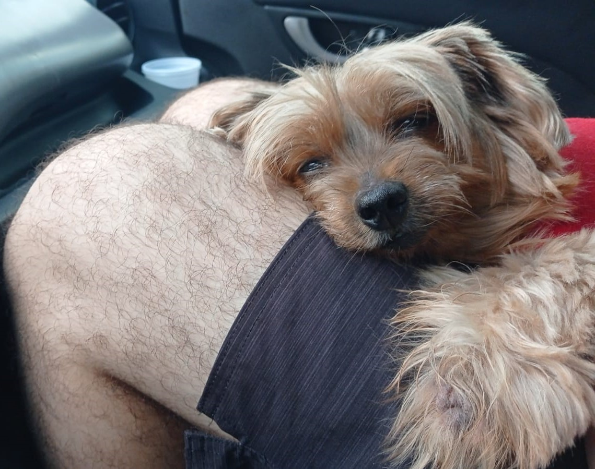
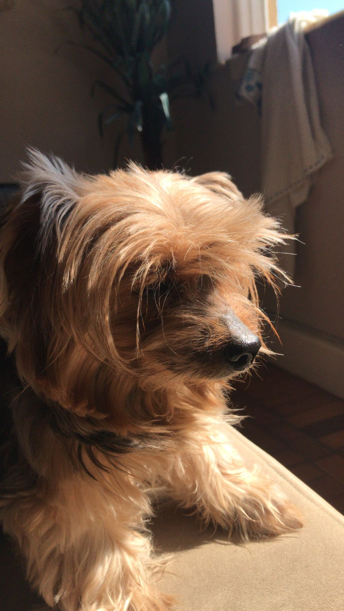

Seu fucinho não é mais tão peludo, mas continua tão doce de ser apertado quanto sempre foi,

Seus olhinhos, mesmo fechados não enxergam mais como antes,

Não tens a mesma energia que antes, dormidinha você fica a maior parte do dia.

Numa primavera fria, sua franjinha brilha no sol,

Um cachorro tao docinho pedinte, que brilha de dengo,

Gastaria toda minha coluna pra te dar banhos quentinhos,

Te secar com secador enquanto você me olha com uma carinha tão inocente de quem tá doida pra sair e correr pela sala.

Meu cheirinho de batata baroa, chumigo d'ouro.

Milinha, você é muito amor!
